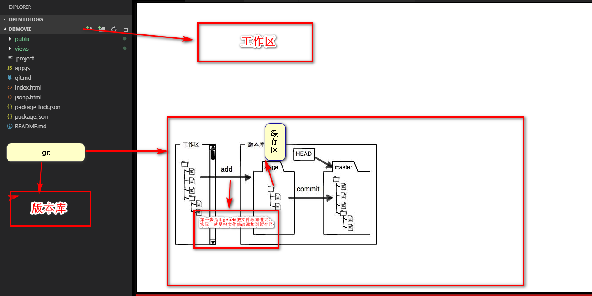

# cmd 命令
		1.mkdir -> 创建一个文件夹
		2.pwd -> 当前目录
		3.如果你没有看到.git目录，那是因为这个目录默认是隐藏的，用ls -ah命令就可以看见。

# git 命令
### $ ssh-keygen -t rsa -C "youremail@example.com"  生成ssh key
		1.用命令git add告诉Git，把文件添加到仓库   git add <file>
		2.用命令git commit告诉Git，把文件提交到仓库 git commit -m <message>
		3.git status命令可以让我们时刻掌握仓库当前的状态（查看缓存区）
		4.git diff看看具体修改了什么内容
		5.git log 查看历史提交记录
		6.git log --pretty=oneline 你看到的一大串类似1094adb...的是commit id（`版本号`）
```javascript
和SVN不一样，Git的commit id不是1，2，3……递增的数字，而是一个SHA1计算出来的一个非常大的数字，用十六进制表示，
而且你看到的commit id和我的肯定不一样，以你自己的为准。为什么commit id需要用这么一大串数字表示呢？因为Git是分布式的
版本控制系统，后面我们还要研究多人在同一个版本库里工作，如果大家都用1，2，3……作为版本号，那肯定就冲突了。
每提交一个新版本，实际上Git就会把它们自动串成一条时间线。如果使用可视化工具查看Git历史，就可以更清楚地看到提交历史的时间线
```
		7.git reset --hard HEAD^  hard指针指向过去
```javascript
上一个版本就是HEAD^，上上一个版本就是HEAD^^，当然往上100个版本写100个^比较容易数不过来，所以写成HEAD~100。
```
		8.git reflog 历史提交分支记录
		9. it rm --cached <file> ...”取消暂存区
		10. 用git diff HEAD -- readme.txt命令可以查看工作区和版本库里面最新版本的区别
		11. git checkout -- file文件在工作区的修改全部撤销 git checkout其实是用版本库里的版本替换工作区的版本
```javascript
1.一种是readme.txt自修改后还没有被放到暂存区，现在，撤销修改就回到和版本库一模一样的状态；

2.一种是readme.txt已经添加到暂存区后，又作了修改，现在，撤销修改就回到添加到暂存区后的状态。
```
		12. git reset HEAD <file>可以把暂存区的修改撤销掉（unstage），重新放回工作区：
```
git reset命令既可以回退版本，也可以把暂存区的修改回退到工作区
```
		13.从版本库中删除该文件，那就用命令(`git rm`)删掉，并且git commit
		14.git remote add origin git@.. 
```javascript
从这个仓库克隆出新的仓库 git remote add origin ，也可以把一个已有的本地仓库与之关联 git @，然后，把本地仓库的内容推送到GitHub仓库
```   
		15.git push -u origin master 推送给远程master的origin库
		   git pull -u origin master 拉取
```javascript
加上了-u参数，Git不但会把本地的master分支内容推送的远程新的master分支，还会把本地的master分支和远程的master分支关联起来，
在以后的推送或者拉取时就可以简化命令。
```
		16.SSH警告
```javascript
当你第一次使用Git的clone或者push命令连接GitHub时，会得到一个警告：

The authenticity of host 'github.com (xx.xx.xx.xx)' can't be established.
RSA key fingerprint is xx.xx.xx.xx.xx.
Are you sure you want to continue connecting (yes/no)?
这是因为Git使用SSH连接，而SSH连接在第一次验证GitHub服务器的Key时，需要你确认GitHub的Key的指纹信息是否真的来自GitHub的服务器，输入yes回车即可。

Git会输出一个警告，告诉你已经把GitHub的Key添加到本机的一个信任列表里了：

Warning: Permanently added 'github.com' (RSA) to the list of known hosts.
这个警告只会出现一次，后面的操作就不会有任何警告了。

如果你实在担心有人冒充GitHub服务器，输入yes前可以对照GitHub的RSA Key的指纹信息是否与SSH连接给出的一致。
```
		17.git clone git@github.com:michaelliao/gitskills.git 克隆一个本地库
```javascript
你也许还注意到，GitHub给出的地址不止一个，还可以用https://github.com/michaelliao/gitskills.git这样的地址。实际上，Git支持多种协议，默认的git://使用ssh，但也可以使用https等其他协议。

使用https除了速度慢以外，还有个最大的麻烦是每次推送都必须输入口令，但是在某些只开放http端口的公司内部就无法使用ssh协议而只能用https。

```

		18.
```
查看分支：git branch

创建分支：git branch <name>

切换分支：git checkout <name>

创建+切换分支：git checkout -b <name>

合并某分支到当前分支：git merge <name>

删除分支：git branch -d <name>
```
		
		